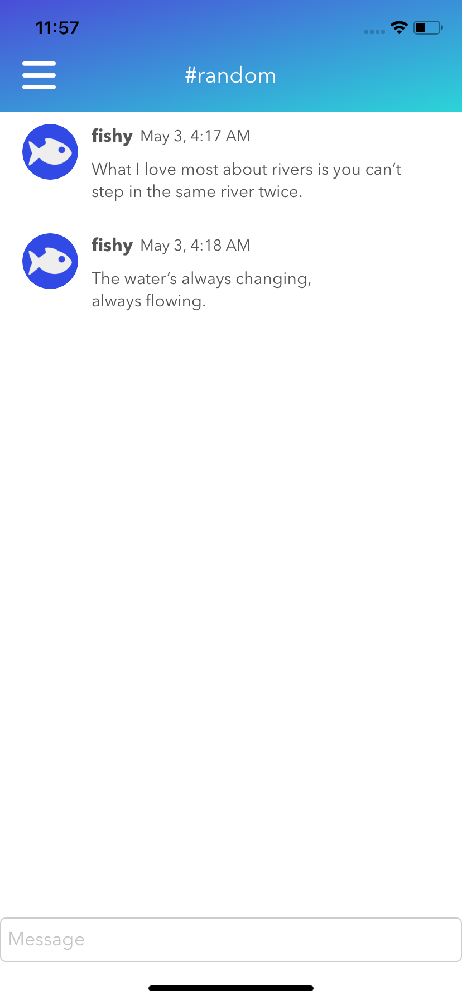
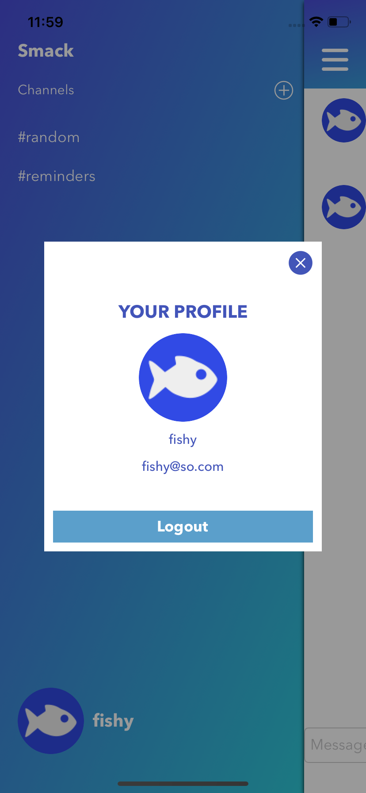
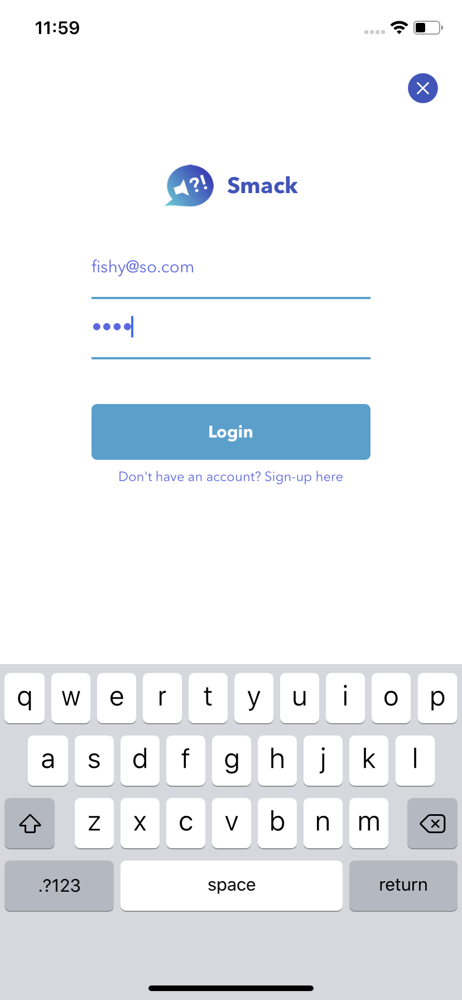
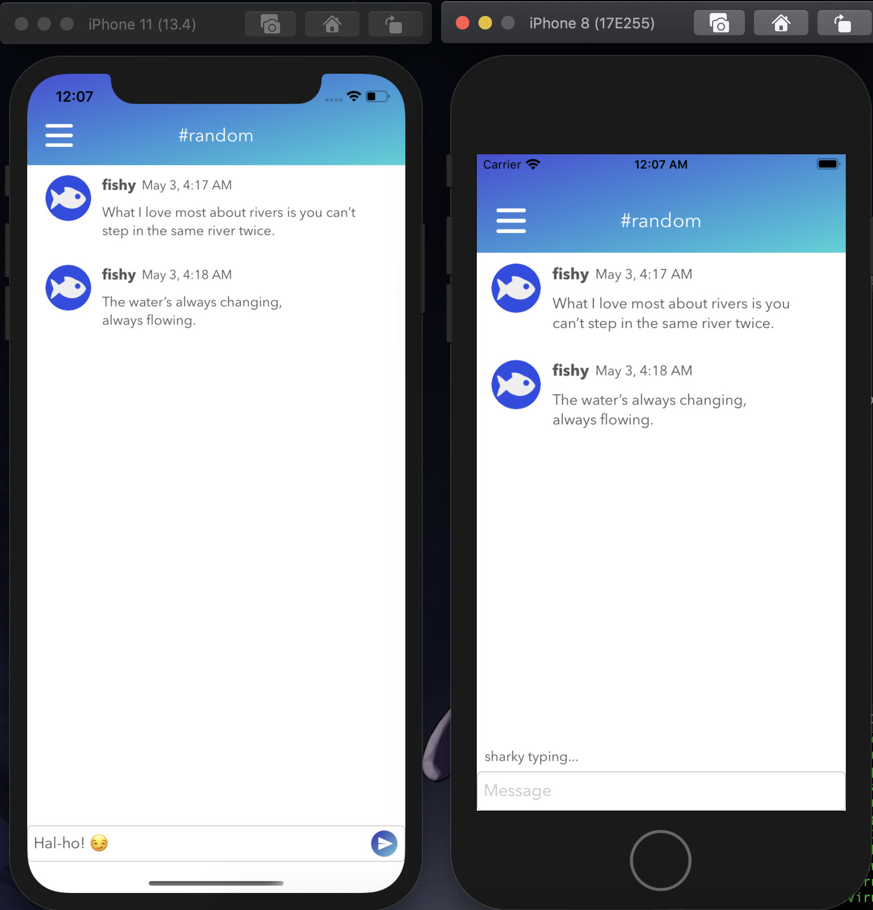

# Smack
Chat App

- cocoapods - Alamofire, SwiftyJSON, Socket.IO-Client-Swift ("pod init" on terminal > open Pod file in cocoapods app > edit > install > close xcodeproj > open workspace)
- SWRevealViewController (Supporting Files Folder [SWRevealViewController.h, SWRevealViewController.m, Smack-Bridging-Header.h], ChatVC.swift, ChannelVC.swift)
- custom gradient view (GradientView.swift)
- unwind segue (CreateAccount.swift)
- userdefaults (AuthService.swift)
- set-up local API (brew services start mongodb-community; npm install > npm run dev)
- button rounded corners (RoundedButton.swift)
- Alamofire (AuthService.swift)
- SwiftyJSON (AuthService.swift)
- random number generator - arc4random_uniform (CreateAccountVC.swift)
- custom attribute field - @IBInspectable (GradientView.swift, RoundedButton.swift)
- loading spinner (CreateAccountVC.swift)
- hide keyboard on tap outside (CreateAccountVC.swift)
- notification (CreateAccountVC.swift)
- XIB (ProfileVC.*)
- close popup on tap outside (ProfileVC.swift)
- JSONDecoder - has to have the exact members of the result (Commented Out: MessageService.swift, Channel.swift)
- Sockets (SocketService.swift, CreateChannelVC.swift, ChannelVC.swift, ChatVC.swift)

      

